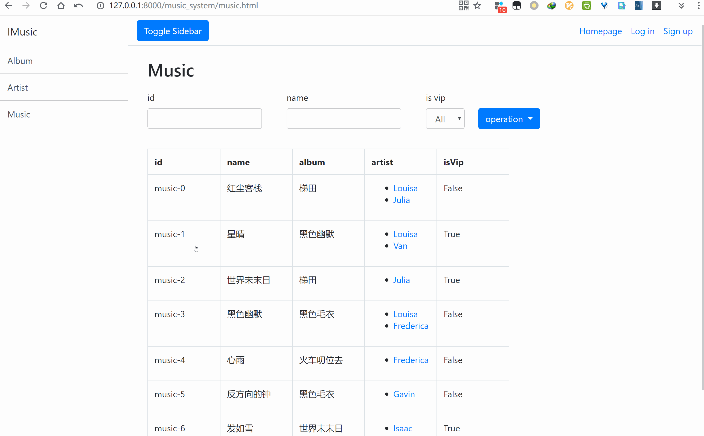
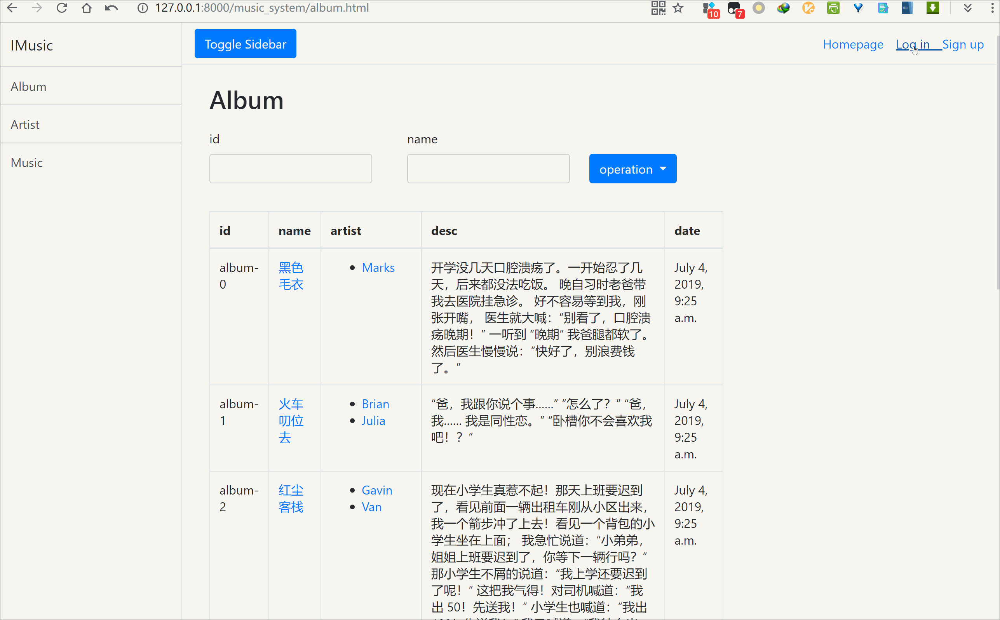

<!--  style=flat/plastic/social,  label force to change the title -->
# 
Music System  

<!--

-->

<!--    copy LICENCE -->
<!-- 控制图片:  -->

## 说明
使用 Django, python3.6+，bootstrap 开发的音乐系统就·

数据是随机产生的，还没有完成注册页面。

部分前端页面，登录页面借鉴于 @Indigo6, @Eliasthunderdog

## 展示

